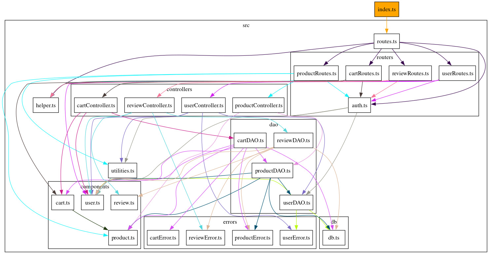
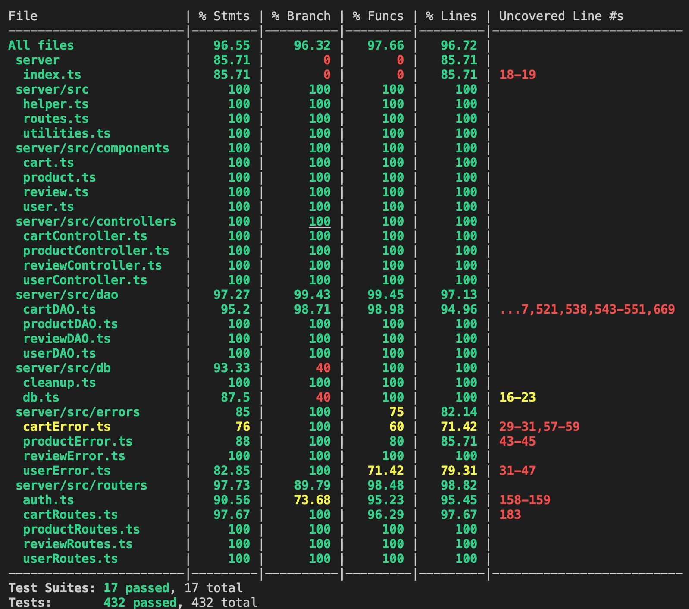

# Test Report

<The goal of this document is to explain how the application was tested, detailing how the test cases were defined and what they cover>

# Contents

- [Test Report](#test-report)
- [Contents](#contents)
- [Dependency graph](#dependency-graph)
- [Integration approach](#integration-approach)
- [Tests](#tests)
- [Coverage](#coverage)
  - [Coverage of FR](#coverage-of-fr)
  - [Coverage white box](#coverage-white-box)

# Dependency graph

Realized with [ts dependency graph](https://github.com/PSeitz/ts-dependency-graph/tree/master)
# Integration approach

    Abbiamo sviluppato gli integration test in maniera mixed, partendo dai diversi components, User,Review,Controller e Routes; in seguito abbiamo testato l'integrazione delle unità tra loro con i i test API.

    step1: Tutti gli unit test sui Products
    step2: Tutti gli unit test sugli Users
    step3: Tutti gli unit test sulle Review
    step4: Tutti gli unit test sui Cart
    step5: API tests

# Tests

<in the table below list the test cases defined For each test report the object tested, the test level (API, integration, unit) and the technique used to define the test case (BB/ eq partitioning, BB/ boundary, WB/ statement coverage, etc)> <split the table if needed>

### Products Dao Unit Tests
| Test case name | Object(s) tested | Test level | Technique used |
| :------------: | :--------------: | :--------: | :------------: |
| PD_001         | getProductbyModel          | Unit       | WB/ statement coverage |
| PD_002         | getProductbyModel          | Unit       | WB/ statement coverage |
| PD_003         | getProductbyModel          | Unit       | WB/ statement coverage |
| PD_004         | getProductbyModel          | Unit       | WB/ statement coverage |
| PD_005         | registerProducts           | Unit       | WB/ statement coverage |
| PD_006         | registerProducts           | Unit       | WB/ statement coverage |
| PD_007         | registerProducts           | Unit       | WB/ statement coverage |
| PD_008         | registerProducts           | Unit       | WB/ statement coverage |
| PD_009         | registerProducts           | Unit       | WB/ statement coverage |
| PD_010         | changeProductQuantity      | Unit       | WB/ statement coverage |
| PD_011         | changeProductQuantity      | Unit       | WB/ statement coverage |
| PD_012         | changeProductQuantity      | Unit       | WB/ statement coverage |
| PD_013         | changeProductQuantity      | Unit       | WB/ statement coverage |
| PD_014         | changeProductQuantity      | Unit       | WB/ statement coverage |
| PD_015         | changeProductQuantity      | Unit       | WB/ statement coverage |
| PD_016         | sellProduct                | Unit       | WB/ statement coverage |
| PD_017         | sellProduct                | Unit       | WB/ statement coverage |
| PD_018         | sellProduct                | Unit       | WB/ statement coverage |
| PD_019         | sellProduct                | Unit       | WB/ statement coverage |
| PD_020         | sellProduct                | Unit       | WB/ statement coverage |
| PD_021         | sellProduct                | Unit       | WB/ statement coverage |
| PD_022         | deleteAllProducts          | Unit       | WB/ statement coverage |
| PD_023         | deleteAllProducts          | Unit       | WB/ statement coverage |
| PD_024         | deleteAllProducts          | Unit       | WB/ statement coverage |
| PD_025         | deleteProduct              | Unit       | WB/ statement coverage |
| PD_026         | deleteProduct              | Unit       | WB/ statement coverage |
| PD_027         | deleteProduct              | Unit       | WB/ statement coverage |
| PD_028         | deleteProduct              | Unit       | WB/ statement coverage |
| PD_029         | getProducts                | Unit       | WB/ statement coverage |
| PD_030         | getProducts                | Unit       | WB/ statement coverage |
| PD_031         | getProducts                | Unit       | WB/ statement coverage |
| PD_032         | getProducts                | Unit       | WB/ statement coverage |
| PD_033         | getProducts                | Unit       | WB/ statement coverage |
| PD_034         | getAvailableProducts       | Unit       | WB/ statement coverage |
| PD_035         | getAvailableProducts       | Unit       | WB/ statement coverage |
| PD_036         | getAvailableProducts       | Unit       | WB/ statement coverage |
| PD_037         | getAvailableProducts       | Unit       | WB/ statement coverage |
| PD_038         | getAvailableProducts       | Unit       | WB/ statement coverage |
| PD_039         | deleteAllProducts          | Unit       | WB/ statement coverage |
| PD_040         | deleteProduct              | Unit       | WB/ statement coverage |

### Products Controller Unit Tests
| Test case name |                Object(s) tested                 | Test level |   Technique used   |
| :------------: | :---------------------------------------------: | :--------: | :----------------: |
| PC_001 | registerProducts        | unit       | WB/ statement coverage |
| PC_002 | registerProducts        | unit       | WB/ statement coverage |
| PC_003 | changeProductQuantity   | unit       | WB/ statement coverage |
| PC_004 | changeProductQuantity   | unit       | WB/ statement coverage |
| PC_005 | sellProduct             | unit       | WB/ statement coverage |
| PC_006 | sellProduct             | unit       | WB/ statement coverage |
| PC_007 | getProducts             | unit       | WB/ statement coverage |
| PC_008 | getAvailableProducts    | unit       | WB/ statement coverage |
| PC_009 | deleteAllProducts       | unit       | WB/ statement coverage |
| PC_010 | deleteProduct           | unit       | WB/ statement coverage |

### Products Routes Unit Tests 
| Test case name                                 | Object(s) tested               | Test level | Technique used        |
| ---------------------------------------------- | ------------------------------ | ---------- | --------------------- |
| PR_001 | route POST/products/ | unit       | WB/ statement coverage |
| PR_002 | route POST/products/ | unit       | WB/ statement coverage |
| PR_003 | route POST/products/ | unit       | WB/ statement coverage |
| PR_004 | route POST/products/ | unit       | WB/ statement coverage |
| PR_005 | route POST/products/ | unit       | WB/ statement coverage |
| PR_006 | route POST/products/ | unit       | WB/ statement coverage |
| PR_007 | route PATCH/products/:model | unit       | WB/ statement coverage |
| PR_008 | route PATCH/products/:model | unit       | WB/ statement coverage |
| PR_009 | route PATCH/products/:model | unit       | WB/ statement coverage |
| PR_010 | route PATCH/products/:model | unit       | WB/ statement coverage |
| PR_011 | route PATCH/products/:model | unit       | WB/ statement coverage |
| PR_012 | route PATCH/products/:model | unit       | WB/ statement coverage |
| PR_013 | route PATCH/products/:model | unit       | WB/ statement coverage |
| PR_014 | route PATCH/products/:model/sell | unit       | WB/ statement coverage |
| PR_015 | route PATCH/products/:model/sell | unit       | WB/ statement coverage |
| PR_016 | route PATCH/products/:model/sell | unit       | WB/ statement coverage |
| PR_017 | route PATCH/products/:model/sell | unit       | WB/ statement coverage |
| PR_018 | route PATCH/products/:model/sell | unit       | WB/ statement coverage |
| PR_019 | route PATCH/products/:model/sell | unit       | WB/ statement coverage |
| PR_020 | route PATCH/products/:model/sell | unit       | WB/ statement coverage |
| PR_021 | route PATCH/products/:model/sell | unit       | WB/ statement coverage |
| PR_022 | route GET/products/ | unit       | WB/ statement coverage |
| PR_023 | route GET/products/ | unit       | WB/ statement coverage |
| PR_024 | route GET/products/ | unit       | WB/ statement coverage |
| PR_025 | route GET/products/ | unit       | WB/ statement coverage |
| PR_026 | route GET/products/ | unit       | WB/ statement coverage |
| PR_027 | route GET/products/ | unit       | WB/ statement coverage |
| PR_028 | route GET/products/ | unit       | WB/ statement coverage |
| PR_029 | route GET/products/available | unit       | WB/ statement coverage |
| PR_030 | route GET/products/available | unit       | WB/ statement coverage |
| PR_031 | route GET/products/available | unit       | WB/ statement coverage |
| PR_032 | route GET/products/available | unit       | WB/ statement coverage |
| PR_033 | route GET/products/available | unit       | WB/ statement coverage |
| PR_034 | route GET/products/available | unit       | WB/ statement coverage |
| PR_035 | route GET/products/available | unit       | WB/ statement coverage |
| PR_036 | route DELETE/products/ | unit       | WB/ statement coverage |
| PR_037 | route DELETE/products/ | unit       | WB/ statement coverage |
| PR_038 | route DELETE/products/:model | unit       | WB/ statement coverage |
| PR_039 | route DELETE/products/:model | unit       | WB/ statement coverage |

### Cart Dao Unit Tests
| Test case name | Object(s) tested | Test level | Technique used |
| :------------: | :--------------: | :--------: | :------------: |
| CD_001         | getCartId          | Unit       | WB/ statement coverage |
| CD_002         | getCartId          | Unit       | WB/ statement coverage |
| CD_003         | getCartId          | Unit       | WB/ statement coverage |
| CD_004         | getCartProducts          | Unit       | WB/ statement coverage |
| CD_005         | getCartProducts           | Unit       | WB/ statement coverage |
| CD_006         | getCartProducts           | Unit       | WB/ statement coverage |
| CD_007         | createCart           | Unit       | WB/ statement coverage |
| CD_008         | createCart           | Unit       | WB/ statement coverage |
| CD_009         | createCart           | Unit       | WB/ statement coverage |
| CD_010         | getCart      | Unit       | WB/ statement coverage |
| CD_011         | getCart      | Unit       | WB/ statement coverage |
| CD_012         | getCart      | Unit       | WB/ statement coverage |
| CD_013         | getCart      | Unit       | WB/ statement coverage |
| CD_014         | getCart      | Unit       | WB/ statement coverage |
| CD_015         | changeProductQuantity      | Unit       | WB/ statement coverage |
| CD_016         | changeProductQuantity                | Unit       | WB/ statement coverage |
| CD_017         | changeProductQuantity                | Unit       | WB/ statement coverage |
| CD_018         | changeProductQuantity                | Unit       | WB/ statement coverage |
| CD_019         | addToCart                | Unit       | WB/ statement coverage |
| CD_020         | addToCart                | Unit       | WB/ statement coverage |
| CD_021         | addToCart                | Unit       | WB/ statement coverage |
| CD_022         | addToCart                | Unit       | WB/ statement coverage |
| CD_023         | takePrice                | Unit       | WB/ statement coverage |
| CD_024         | takePrice                | Unit       | WB/ statement coverage |
| CD_025         | takePrice          | Unit       | WB/ statement coverage |
| CD_026         | takeCategory          | Unit       | WB/ statement coverage |
| CD_027         | takeCategory          | Unit       | WB/ statement coverage |
| CD_028         | takeCategory              | Unit       | WB/ statement coverage |
| CD_029         | takeQuantity              | Unit       | WB/ statement coverage |
| CD_030         | takeQuantity              | Unit       | WB/ statement coverage |
| CD_031         | takeQuantity              | Unit       | WB/ statement coverage |
| CD_032         | changeQuantityOnCarts                | Unit       | WB/ statement coverage |
| CD_033         | changeQuantityOnCarts                | Unit       | WB/ statement coverage |
| CD_034         | changeQuantityOnCarts                | Unit       | WB/ statement coverage |
| CD_035         | getProduct                | Unit       | WB/ statement coverage |
| CD_036         | getProduct                | Unit       | WB/ statement coverage |
| CD_037         | getProduct       | Unit       | WB/ statement coverage |
| CD_038         | checkoutCart       | Unit       | WB/ statement coverage |
| CD_039         | checkoutCart       | Unit       | WB/ statement coverage |
| CD_040         | checkoutCart       | Unit       | WB/ statement coverage |
| CD_041         | checkoutCart       | Unit       | WB/ statement coverage |
| CD_042         | checkoutCart          | Unit       | WB/ statement coverage |
| CD_043         | checkoutCart              | Unit       | WB/ statement coverage |
| CD_044         | checkoutCart              | Unit       | WB/ statement coverage |
| CD_045         | getProductsById          | Unit       | WB/ statement coverage |
| CD_046         | getProductsById              | Unit       | WB/ statement coverage |
| CD_047         | getProductsById              | Unit       | WB/ statement coverage |
| CD_048         | getCustomerCarts          | Unit       | WB/ statement coverage |
| CD_049         | getCustomerCarts              | Unit       | WB/ statement coverage |
| CD_050         | getCustomerCarts              | Unit       | WB/ statement coverage |
| CD_051         | removeProductFromCart          | Unit       | WB/ statement coverage |
| CD_052         | removeProductFromCart              | Unit       | WB/ statement coverage |
| CD_053         | removeProductFromCart              | Unit       | WB/ statement coverage |
| CD_054         | removeProductFromCart          | Unit       | WB/ statement coverage |
| CD_055         | removeProductFromCart              | Unit       | WB/ statement coverage |
| CD_056         | removeProductFromCart              | Unit       | WB/ statement coverage |
| CD_057         | removeProductFromCart          | Unit       | WB/ statement coverage |
| CD_058         | removeProductFromCart              | Unit       | WB/ statement coverage |
| CD_059         | clearCart              | Unit       | WB/ statement coverage |
| CD_060         | clearCart              | Unit       | WB/ statement coverage |
| CD_061         | clearCart          | Unit       | WB/ statement coverage |
| CD_062         | clearCart              | Unit       | WB/ statement coverage |
| CD_063         | clearCart              | Unit       | WB/ statement coverage |
| CD_064         | deleteAllCarts              | Unit       | WB/ statement coverage |
| CD_065         | deleteAllCarts              | Unit       | WB/ statement coverage |
| CD_066         | deleteAllCarts          | Unit       | WB/ statement coverage |
| CD_067         | deleteAllCarts              | Unit       | WB/ statement coverage |
| CD_068         | deleteAllCarts              | Unit       | WB/ statement coverage |
| CD_069         | getAllCarts          | Unit       | WB/ statement coverage |
| CD_070         | getAllCarts              | Unit       | WB/ statement coverage |
| CD_071         | getAllCarts              | Unit       | WB/ statement coverage |

### Cart Controller Unit Tests
| Test case name | Object(s) tested | Test level | Technique used |
| :------------: | :--------------: | :--------: | :------------: |
| CC_01         | addToCart          | Unit       | WB/ statement coverage |
| CC_002         | addToCart          | Unit       | WB/ statement coverage |
| CC_003         | getCart          | Unit       | WB/ statement coverage |
| CC_004         | getCart           | Unit       | WB/ statement coverage |
| CC_005         | checkoutCart           | Unit       | WB/ statement coverage |
| CC_006        | checkoutCart      | Unit       | WB/ statement coverage |
| CC_007         | getCustomerCarts           | Unit       | WB/ statement coverage |
| CC_008         | getCustomerCarts           | Unit       | WB/ statement coverage |
| CC_009         | removeProductFromCart           | Unit       | WB/ statement coverage |
| CC_010         | removeProductFromCart      | Unit       | WB/ statement coverage |
| CC_011         | removeProductFromCart      | Unit       | WB/ statement coverage |
| CC_012         | removeProductFromCart      | Unit       | WB/ statement coverage |
| CC_013         | clearCart      | Unit       | WB/ statement coverage |
| CC_014         | getAllCarts      | Unit       | WB/ statement coverage |
| CC_015         | deleteAllCarts                | Unit       | WB/ statement coverage |

### Cart Routes Unit Tests
| Test case name | Object(s) tested | Test level | Technique used |
| :------------: | :--------------: | :--------: | :------------: |
| CR_001         | GET /          | Unit       | WB/ statement coverage |
| CR_002         | GET /         | Unit       | WB/ statement coverage |
| CR_003         | GET /          | Unit       | WB/ statement coverage |
| CR_004         | PATCH /          | Unit       | WB/ statement coverage |
| CR_005         | PATCH /           | Unit       | WB/ statement coverage |
| CR_006         | GET /history           | Unit       | WB/ statement coverage |
| CR_007         | GET /history           | Unit       | WB/ statement coverage |
| CR_008         | DELETE /products/:model           | Unit       | WB/ statement coverage |
| CR_009         | DELETE /products/:model           | Unit       | WB/ statement coverage |
| CR_010         | DELETE /current      | Unit       | WB/ statement coverage |
| CR_011         | DELETE /current      | Unit       | WB/ statement coverage |
| CR_012         | DELETE /      | Unit       | WB/ statement coverage |
| CR_013         | DELETE /      | Unit       | WB/ statement coverage |
| CR_014         | GET /all      | Unit       | WB/ statement coverage |
| CR_015         | GET /all      | Unit       | WB/ statement coverage |
| CR_016         | POST /                | Unit       | WB/ statement coverage |
| CR_017         | POST /                | Unit       | WB/ statement coverage |

### User Dao Unit Tests
| Test case name | Object(s) tested | Test level | Technique used |
| :------------: | :--------------: | :--------: | :------------: |
| UD_001         | getIsUserAuthenticated          | Unit       | WB/ statement coverage |
| UD_002         | getIsUserAuthenticated          | Unit       | WB/ statement coverage |
| UD_003         | getIsUserAuthenticated          | Unit       | WB/ statement coverage |
| UD_004         | getIsUserAuthenticated          | Unit       | WB/ statement coverage |
| UD_005         | getIsUserAuthenticated           | Unit       | WB/ statement coverage |
| UD_006         | createUser           | Unit       | WB/ statement coverage |
| UD_007         | createUser           | Unit       | WB/ statement coverage |
| UD_008         | createUser           | Unit       | WB/ statement coverage |
| UD_009         | getUserByUsername           | Unit       | WB/ statement coverage |
| UD_010         | getUserByUsername      | Unit       | WB/ statement coverage |
| UD_011         | getUserByUsername      | Unit       | WB/ statement coverage |
| UD_012         | getUserByUsername      | Unit       | WB/ statement coverage |
| UD_013         | getAllUsers      | Unit       | WB/ statement coverage |
| UD_014         | getAllUsers  | Unit       | WB/ statement coverage |
| UD_015         | getAllUsers      | Unit       | WB/ statement coverage |
| UD_016         | getUsersByRole                | Unit       | WB/ statement coverage |
| UD_017         | getUsersByRole                | Unit       | WB/ statement coverage |
| UD_018         | getUsersByRole                | Unit       | WB/ statement coverage |
| UD_019         | deleteUser                | Unit       | WB/ statement coverage |
| UD_020         | deleteUser                | Unit       | WB/ statement coverage |
| UD_021         | deleteUser               | Unit       | WB/ statement coverage |
| UD_022         | deleteAll                | Unit       | WB/ statement coverage |
| UD_023         | deleteAll                | Unit       | WB/ statement coverage |
| UD_024         | deleteAll                | Unit       | WB/ statement coverage |
| UD_025         | patchUser          | Unit       | WB/ statement coverage |
| UD_026         | patchUser          | Unit       | WB/ statement coverage |
| UD_027         | patchUser          | Unit       | WB/ statement coverage |

### User Controller Unit Tests
| Test case name | Object(s) tested | Test level | Technique used |
| :------------: | :--------------: | :--------: | :------------: |
| UC_001         | createUser          | Unit       | WB/ statement coverage |
| UC_002         | getUsers          | Unit       | WB/ statement coverage |
| UC_003         | getUsersByRole          | Unit       | WB/ statement coverage |
| UC_004         | getUserByUsername          | Unit       | WB/ statement coverage |
| UC_005         | getUserByUsername           | Unit       | WB/ statement coverage |
| UC_006         | getUserByUsername           | Unit       | WB/ statement coverage |
| UC_007         | deleteUser           | Unit       | WB/ statement coverage |
| UC_008         | deleteUser           | Unit       | WB/ statement coverage |
| UC_009         | deleteUser           | Unit       | WB/ statement coverage |
| UC_010         | deleteUser      | Unit       | WB/ statement coverage |
| UC_011         | deleteUser      | Unit       | WB/ statement coverage |
| UC_012         | deleteUser                | Unit       | WB/ statement coverage |
| UC_013         | deleteAll      | Unit       | WB/ statement coverage |
| UC_014         | patchUser      | Unit       | WB/ statement coverage |
| UC_015         | patchUser  | Unit       | WB/ statement coverage |
| UC_016         | patchUser      | Unit       | WB/ statement coverage |
| UC_017         | patchUser                | Unit       | WB/ statement coverage |
| UC_018         | patchUser                | Unit       | WB/ statement coverage |
| UC_019         | patchUser                | Unit       | WB/ statement coverage |

### User Routes Unit Tests
| Test case name | Object(s) tested | Test level | Technique used |
| :------------: | :--------------: | :--------: | :------------: |
| UR_001         | POST /users          | Unit       | WB/ statement coverage |
| UR_002         | POST /users          | Unit       | WB/ statement coverage |
| UR_003         | POST /users          | Unit       | WB/ statement coverage |
| UR_004         | POST /users          | Unit       | WB/ statement coverage |
| UR_005         | GET /users           | Unit       | WB/ statement coverage |
| UR_006         | GET /users           | Unit       | WB/ statement coverage |
| UR_007         | GET /users           | Unit       | WB/ statement coverage |
| UR_008         | GET /users/:role           | Unit       | WB/ statement coverage |
| UR_009         | GET /users/:role           | Unit       | WB/ statement coverage |
| UR_010         | GET /users/:role      | Unit       | WB/ statement coverage |
| UR_011         | GET /users/:username      | Unit       | WB/ statement coverage |
| UR_012         | GET /users/:username      | Unit       | WB/ statement coverage |
| UR_013         | GET /users/:username      | Unit       | WB/ statement coverage |
| UR_014         | GET /users/:username  | Unit       | WB/ statement coverage |
| UR_015         | DELETE /users/:username      | Unit       | WB/ statement coverage |
| UR_016         | DELETE /users/:username                | Unit       | WB/ statement coverage |
| UR_017         | DELETE /users/:username       | Unit       | WB/ statement coverage |
| UR_018         | DELETE /users/:username       | Unit       | WB/ statement coverage |
| UR_019         | DELETE /users/:username   | Unit       | WB/ statement coverage |
| UR_020         | DELETE /users   | Unit       | WB/ statement coverage |
| UR_021         | DELETE /users            | Unit       | WB/ statement coverage |
| UR_022         | DELETE /users            | Unit       | WB/ statement coverage |
| UR_023         | PATCH /users/:username            | Unit       | WB/ statement coverage |
| UR_024         | PATCH /users/:username   | Unit       | WB/ statement coverage |
| UR_025         | PATCH /users/:username| Unit       | WB/ statement coverage |
| UR_026         | PATCH /users/:username| Unit       | WB/ statement coverage |
| UR_027         | PATCH /users/:username| Unit       | WB/ statement coverage |
| UR_028         | PATCH /users/:username| Unit       | WB/ statement coverage |
| UR_029         | POST /login| Unit       | WB/ statement coverage |
| UR_030         | POST /login| Unit       | WB/ statement coverage |
| UR_031         | POST /login| Unit       | WB/ statement coverage |
| UR_032         | DELETE /logout| Unit       | WB/ statement coverage |
| UR_033         | DELETE /logout| Unit       | WB/ statement coverage |
| UR_034         | GET /current| Unit       | WB/ statement coverage |

### Review Dao Unit Tests
| Test case name | Object(s) tested | Test level | Technique used |
| :------------: | :--------------: | :--------: | :------------: |
| RD_001         | addReview          | Unit       | WB/ statement coverage |
| RD_002         | addReview          | Unit       | WB/ statement coverage |
| RD_003         | addReview          | Unit       | WB/ statement coverage |
| RD_004         | addReview          | Unit       | WB/ statement coverage |
| RD_005         | addReview           | Unit       | WB/ statement coverage |
| RD_006         | getProductReviews           | Unit       | WB/ statement coverage |
| RD_007         | getProductReviews    | Unit       | WB/ statement coverage |
| RD_008         | getProductReviews    | Unit       | WB/ statement coverage |
| RD_009         | getProductReviews    | Unit       | WB/ statement coverage |
| RD_010         | deleteProductReview      | Unit       | WB/ statement coverage |
| RD_011         | deleteProductReview| Unit       | WB/ statement coverage |
| RD_012         | deleteProductReview| Unit       | WB/ statement coverage |
| RD_013         | deleteProductReview| Unit       | WB/ statement coverage |
| RD_014         | deleteProductReview| Unit       | WB/ statement coverage |
| RD_015         | deleteProductReview      | Unit       | WB/ statement coverage |
| RD_016         | deleteAllReviews                | Unit       | WB/ statement coverage |
| RD_017         | deleteAllReviews                | Unit       | WB/ statement coverage |
| RD_018         | deleteReviewsOfProduct                | Unit       | WB/ statement coverage |
| RD_019         | deleteReviewsOfProduct                | Unit       | WB/ statement coverage |

### Review Controller Unit Tests
| Test case name | Object(s) tested | Test level | Technique used |
| :------------: | :--------------: | :--------: | :------------: |
| RC_001         | addReview          | Unit       | WB/ statement coverage |
| RC_002         | addReview          | Unit       | WB/ statement coverage |
| RC_003         | addReview          | Unit       | WB/ statement coverage |
| RC_004         | getProductReviews          | Unit       | WB/ statement coverage |
| RC_005         | getProductReviews         | Unit       | WB/ statement coverage |
| RC_006         | deleteReview           | Unit       | WB/ statement coverage |
| RC_007         | deleteReview         | Unit       | WB/ statement coverage |
| RC_008         | deleteReview         | Unit       | WB/ statement coverage |
| RC_009         | deleteReview| Unit       | WB/ statement coverage |
| RC_010         | deleteReviewsOfProduct           | Unit       | WB/ statement coverage |
|RC_011         | deleteReviewsOfProduct           | Unit       | WB/ statement coverage |
| RC_012         | deleteAllReviews| Unit       | WB/ statement coverage |
| RC_013         | deleteAllReviews| Unit       | WB/ statement coverage |

### Review Route Unit Tests
| Test case name | Object(s) tested | Test level | Technique used |
| :------------: | :--------------: | :--------: | :------------: |
| RR_001         | POST /:model          | Unit       | WB/ statement coverage |
| RR_002         | POST /:model       | Unit       | WB/ statement coverage |
| RR_003         | POST /:model       | Unit       | WB/ statement coverage |
| RR_004         | POST /:model          | Unit       | WB/ statement coverage |
| RR_005         | DELETE /:model           | Unit       | WB/ statement coverage |
| RR_006         | DELETE /:model           | Unit       | WB/ statement coverage |
| RR_007         | DELETE /:model       | Unit       | WB/ statement coverage |
| RR_008         | DELETE /:model       | Unit       | WB/ statement coverage |
| RR_009        | DELETE /:model/all| Unit       | WB/ statement coverage |
| RR_010         | DELETE /:model/all| Unit       | WB/ statement coverage |
| RR_011         | DELETE /:model/all| Unit       | WB/ statement coverage |
| RR_012         | DELETE /:model/all| Unit       | WB/ statement coverage |
| RR_013         | DELETE /| Unit       | WB/ statement coverage |
| RR_014         | DELETE /      | Unit       | WB/ statement coverage |
| RR_015         | DELETE /                | Unit       | WB/ statement coverage |
| RR_016         | DELETE /                | Unit       | WB/ statement coverage |
| RR_017         | GET /:model                | Unit       | WB/ statement coverage |
| RR_018         | GET /:model              | Unit       | WB/ statement coverage |
| RR_019         | GET /:model              | Unit       | WB/ statement coverage |

### Products Integration Tests
| Test case name | Object(s) tested | Test level | Technique used |
| :------------: | :--------------: | :--------: | :------------: |
| IP_001        | POST /products          | Integration       | BB/ boundary |
| IP_002         | POST /products       | Integration | BB/ boundary |
| IP_003         | POST /products        | Integration | BB/ boundary|
| IP_004         | POST /products        | Integration| BB/ boundary|
| IP_005         | POST /products        | Integration| BB/ boundary|
| IP_006         | POST /products        | Integration| BB/ boundary|
| IP_007         | POST /products        | Integration| BB/ boundary|
| IP_008         | PATCH /products/:model        | Integration       |BB/ boundary |
| IP_009         | PATCH /products/:model| Integration | BB/ boundary|
| IP_010         | PATCH /products/:model| Integration | BB/ boundary|
| IP_011         | PATCH /products/:model| Integration| BB/ boundary|
| IP_012         | PATCH /products/:model| Integration| BB/ boundary|
| IP_013         | PATCH /products/:model| Integration| BB/ boundary|
| IP_014         | PATCH /products/:model/sell        | Integration|BB/ boundary |
| IP_015         | PATCH /products/:model/sell| Integration| BB/ boundary|
| IP_016         | PATCH /products/:model/sell   | Integration       | BB/ boundary |
| IP_017         | PATCH /products/:model/sell| Integration | BB/ boundary|
| IP_018         | PATCH /products/:model/sell| Integration | BB/ boundary|
| IP_019         | PATCH /products/:model/sell| Integration| BB/ boundary|
| IP_020         | PATCH /products/:model/sell| Integration| BB/ boundary|
| IP_021         | GET /products/available| Integration| BB/ boundary|
| IP_022         | GET /products/available| Integration | BB/ boundary|
| IP_023         | GET /products/available| Integration | BB/ boundary|
| IP_024         | GET /products/available| Integration| BB/ boundary|
| IP_025         | GET /products/available| Integration| BB/ boundary|
| IP_026         | GET /products/available| Integration| BB/ boundary|
| IP_027         | DELETE /products/:model| Integration| BB/ boundary|
| IP_028         | DELETE /products/:model| Integration| BB/ boundary|
| IP_029         | DELETE /products| Integration| BB/ boundary|

### Users Integration Tests
| Test case name | Object(s) tested | Test level | Technique used |
| :------------: | :--------------: | :--------: | :------------: |
| IU_001        | POST /users          | Integration       | BB/ boundary |
| IU_002         | POST /users       | Integration | BB/ boundary |
| IU_003         | POST /users        | Integration | BB/ boundary|
| IU_004         | GET /users       | Integration| BB/ boundary|
| IU_005         | GET /users        | Integration| BB/ boundary|
| IU_006         | GET /users        | Integration| BB/ boundary|
| IU_007         | GET /users/:role        | Integration| BB/ boundary|
| IU_008         | GET /users/:role        | Integration       | BB/ boundary|
| IU_009         | GET /users/:role| Integration | BB/ boundary|
| IU_010         | GET /users/:username| Integration | BB/ boundary|
| IU_011         | GET /users/:username| Integration| BB/ boundary|
| IU_012         | GET /users/:username| Integration| BB/ boundary|
| IU_013         | GET /users/:username| Integration| BB/ boundary|
| IU_014         | PATCH /users/:username        | Integration| BB/ boundary |
| IU_015         | PATCH /users/:username| Integration| BB/ boundary|
| IU_016         | PATCH /users/:username   | Integration       | BB/ boundary |
| IU_017         | PATCH /users/:username| Integration | BB/ boundary|
| IU_018         | PATCH /users/:username| Integration | BB/ boundary|
| IU_019         | PATCH /users/:username| Integration| BB/ boundary|
| IU_020         | PATCH /users/:username| Integration| BB/ boundary |
| IU_021         | PATCH /users/:username| Integration| BB/ boundary|
| IU_022         | PATCH /users/:username| Integration | BB/ boundary|
| IU_023         | DELETE /users/:username| Integration | BB/ boundary|
| IU_024         | DELETE /users/:username| Integration| BB/ boundary|
| IU_025         | DELETE /users/:username| Integration| BB/ boundary|
| IU_026         | DELETE /users/:username| Integration| BB/ boundary|
| IU_027         | DELETE /users/:username| Integration| BB/ boundary|
| IU_028         | DELETE /users/:username| Integration| BB/ boundary|
| IU_029         | DELETE /users| Integration| BB/ boundary|
| IU_030         | DELETE /users| Integration| BB/ boundary|
| IU_031         | POST /sessions| Integration| BB/ boundary|
| IU_032         | POST /sessions| Integration| BB/ boundary|
| IU_033         | POST /sessions| Integration| BB/ boundary|
| IU_034         | GET /sessions| Integration| BB/ boundary|
| IU_035         | GET /sessions| Integration| BB/ boundary|
| IU_036         | DELETE /sessions| Integration| BB/ boundary|

### Reviews Integration Tests
| Test case name | Object(s) tested | Test level | Technique used |
| :------------: | :--------------: | :--------: | :------------: |
| IR_001        | POST /reviews/:model          | Integration       | BB/ boundary |
| IR_002         | POST /reviews/:model       | Integration | BB/ boundary|
| IR_003         | POST /reviews/:model        | Integration | BB/ boundary|
| IR_004         | POST /reviews/:model| Integration| BB/ boundary|
| IR_005         | POST /reviews/:model| Integration| BB/ boundary|
| IR_006         | GET /reviews/:model| Integration| BB/ boundary|
| IR_007         | GET /reviews/:model     | Integration| BB/ boundary|
| IR_008         | DELETE /reviews/:model      | Integration       | BB/ boundary |
| IR_009         | DELETE /reviews/:model| Integration | BB/ boundary|
| IR_010         | DELETE /reviews/:model| Integration | BB/ boundary|
| IR_011         | DELETE /reviews/:model| Integration| BB/ boundary|
| IR_012         | DELETE /reviews/:model/all| Integration| BB/ boundary|
| IR_013         | DELETE /reviews/:model/all| Integration| BB/ boundary|
| IR_014         | DELETE /reviews/:model/all        | Integration| BB/ boundary|
| IR_015         | DELETE /reviews| Integration| BB/ boundary|
| IR_016         | DELETE /reviews   | Integration       | BB/ boundary |

### Carts Integration Tests
| Test case name | Object(s) tested | Test level | Technique used |
| :------------: | :--------------: | :--------: | :------------: |
| IC_001        | GET /cart          | Integration       | BB/ boundary |
| IC_002         | GET /cart       | Integration | BB/ boundary|
| IC_003         | GET /cart        | Integration | BB/ boundary|
| IC_004         | POST /cart| Integration| BB/ boundary|
| IC_005         | POST /cart| Integration| BB/ boundary|
| IC_006         | POST /cart| Integration| BB/ boundary|
| IC_007         | PATCH /cart      | Integration       | BB/ boundary |
| IC_008         | PATCH /cart| Integration | BB/ boundary|
| IC_009         | PATCH /cart| Integration | BB/ boundary|
| IC_010         | PATCH /cart| Integration| BB/ boundary|
| IC_011         | PATCH /cart| Integration| BB/ boundary|
| IC_012         | GET /cart/history| Integration| BB/ boundary|
| IC_013         | DELETE /cart/products/:model        | Integration| BB/ boundary|
| IC_014         | DELETE /cart/products/:model| Integration| BB/ boundary|
| IC_015         | DELETE /cart/products/:model| Integration       | BB/ boundary |
| IC_016         | DELETE /cart/products/:model        | Integration| BB/ boundary|
| IC_017         | DELETE /cart/products/:model| Integration| BB/ boundary|
| IC_018         | DELETE /cart/products/:model| Integration       | BB/ boundary |
| IC_019         | DELETE /cart/current| Integration| BB/ boundary|
| IC_020         | DELETE /cart/current| Integration       | BB/ boundary |
| IC_021         | GET /cart/all| Integration| BB/ boundary|
| IC_022         | GET /cart/all| Integration       | BB/ boundary |
| IC_023         | DELETE /cart| Integration| BB/ boundary|
| IC_024         | DELETE /cart| Integration       | BB/ boundary |

# Coverage

## Coverage of FR

<Report in the following table the coverage of functional requirements and scenarios(from official requirements) >
|   ID   | Functional Requirement                           | Test(s)               |
| :----: | :----------------------------------------------- | :-------------------- |
| **FR1**| **Manage account**                               |                       |
|  FR1.1  | Login                                            |  UD_001-UD_005,UR_029-UR_031, IU_031-IU_034                    |
|  FR1.2  | Logout                                           |    UR_032,UR_033,   IU_036              |
|  FR1.3  | Create a new user account                        |      UC_01,UR_01-UR_04,UD_06-UD_08,IU_001-IU_003                 |
| **FR2**| **Manage users**                                 |                       |
|  FR2.1  | Show the list of all users                       |  UR_005-UR_007,UC_002,UI_004-IO_006,UD_013-UD_015                     |
|  FR2.2  | Show the list of all users with a specific role  |  UR_008-UR_010,UC_003,UD_016-UD_018, IU_007-IU_009                    |
|  FR2.3  | Show the information of a single user            |   UR_011-UR_014,UC_004-UC_006,UD_009-UD_012, IU_010-IU_013              |
|  FR2.4  | Update the information of a single user          |   UR_023-UR_038,UC_014-UC_019, UD_025-UD_027,IU_015-IU_022                   |
|  FR2.5  | Delete a single _non Admin_ user                 |   UR_015-UR_019,UC_007-UC_012,UD_019-UD_021,IU_023-IU_028                    |
|  FR2.6  | Delete all _non Admin_ users                     |     UR_020-UR_022,UC_013,UD_022-UD_024,IU_029,IU_030                  |
| **FR3**| **Manage products**                              |                       |
|  FR3.1 | Register a set of new products                   | PR_001-PR_006, PC_001, PC_002, PD_005-PD_009,IP_001-IP_007 |
|  FR3.2 | Update the quantity of a product                 | PR_007-PR_013, PC_003, PC_004, PD_010-PD_015,IP_008-IP_013 |
|  FR3.3 | Sell a product                                   | PR_014-PR_021, PC_005, PC_006, PD_016-PD_021,IP_014-IP_014 |
|  FR3.4 | Show the list of all products                    | PR_022, PR_028, PC_007, PD_029-PD_033 |
|  FR3.4.1 | Show the list of all available products        | PR_029, PR_035, PC_008, PD_034-PD_038,IP_021-IP_02 |
|  FR3.5 | Show the list of all products with the same category | PR_023-PR_025 |
|  FR3.5.1 | Show the list of all available products with the same category | PR_030, PR_032-PR_033 |
|  FR3.6 | Show the list of all products with the same model | PR_026-PR_027 |
|  FR3.6.1 | Show the list of all available products with the same model | PR_031, PR_034 |
|  FR3.7 | Delete a product                                 | PR_036-PR_037, PC_010, PD_025-PD_028, PD_040,IP_027-IP_028 |
|  FR3.8 | Delete all products                              | PR_038-PR_039, PC_009, PD_022-PD_024, PD_039,IP_030 |
| **FR4**| **Manage reviews**                               |                       |
|  FR4.1  | Add a new review to a product                    |    RR_001-RR_004,RC_001-RC_003,RD_001-RD_005,IR_001-IR_005                    |
|  FR4.2  | Get the list of all reviews assigned to a product|RR_017-RR_019,RC_004,RC_005, RD_006-RD_009,IR_006,IR_007                       |
|  FR4.3  | Delete a review given to a product               |  RR_005-RR_008, RC_006-RC_009, RD_010-RD_015,IR_008-IR_011                   |
|  FR4.4  | Delete all reviews of a product                  | RR_009-RR_012,RC_010,RC_011  RD_016,RD_017,IR_012-IR_014      |
|  FR4.5  | Delete all reviews of all products               |  RR_014-RR_016,RC_012,RC_013,  RD_018,RD_019,IR_015-IR_016              |
| **FR5**| **Manage carts**                                 |                       |
|  FR5.1  | Show the information of the current cart         |    CR_001-CR_003,CC_003,CC_004,IC_001-IC_003   CD_010-CD_014                |
|  FR5.2  | Add a product to the current cart                |CR_004,CR_005,CC_001,CC_002,CD_019-CD_022, IC_004-IC_006                      |
|  FR5.3  | Checkout the current cart                        |    CR_004,CR_005,CC_005,CC_006, CD_038-CD_044, IC_008-IC_011                  |
|  FR5.4  | Show the history of the paid carts               | CR_006,CR_007,CC_007,CC_008,CD_048-CD_050 , IC_012                  |
|  FR5.5  | Remove a product from the current cart           |   CR_008,CR_009,CC_009-CC_012,CD_051-CD_058  ,IC_013-IC_018                  |
|  FR5.6  | Delete the current cart                          |   CR_010,CR_011,CD_059-CD_063,CC_013,IC_019,IC_020                    |
|  FR5.7  | See the list of all carts of all users          |CR_014,CR_015,CC_014,CD_069-CD_071,IC_021,IC_022                       |
|  FR5.8  | Delete all carts                                 | CR_012,CR_013,CC_015,CD_064_CD_068,IC_023,IC_024                      |

## Coverage white box

Report here the screenshot of coverage values obtained with jest-- coverage

